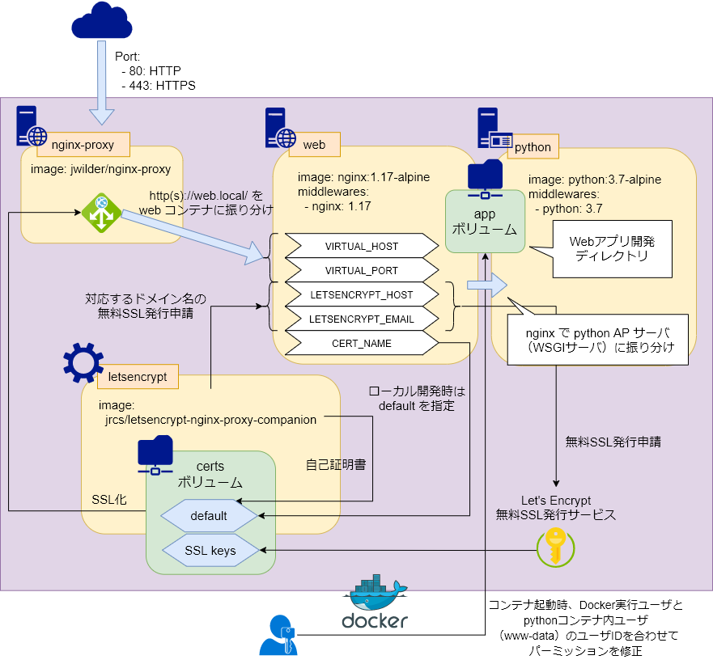

# WSGI API Server

Python の標準ライブラリで API サーバ実装

## Environment

- OS:
    - Windows 10
    - Ubuntu 18.04
- Python: `3.6.10` (Anaconda `4.7.12`)

***

## wsgiref 標準ライブラリによる http サーバ

### server.py
```python
# encoding: utf-8
from wsgiref.simple_server import make_server

def app(environ, start_response):
    status = '200 OK'
    headers = [('Content-type', 'text/plain; charset=utf-8')]
    start_response(status, headers)
    return [b"Hello World"]

with make_server('', 8000, app) as httpd:
    print("Serving on http://localhost:8000 ...")
    httpd.serve_forever()
```

以下のコマンドでサーバ実行

```bash
$ python server.py

# => Serving on http://localhost:8000 ...
```

***

## Nginx + uWSGI サーバ

### 構成
```bash
./
|_ app/ # 作業ディレクトリ => docker://web,python:/var/www/app/
|   |_ vassals/  # uWSGI設定ファイル格納ディレクトリ
|   |   |_ server.ini # server.py 用の uWSGI 設定ファイル: docker://python:3000
|   |
|   |_ static/   # 静的ファイル配信用ディレクトリ
|   |_ server.py # WSGIサーバ
|
|_ docker/ # Dockerコンテナ設定
|   |_ certs/  # SSL証明書格納ディレクトリ
|   |_ python/ # pythonコンテナ
|   |   |_ Dockerfile
|   |   |_ requirements.txt # 必要なpythonライブラリを記述
|   |
|   |_ web/    # webコンテナ: https://web.local/ => docker://web:80
|       |_ Dockerfile
|       |_ nginx.conf # Nginx設定ファイル
|                     ## docker://web:80/static/ => /var/www/app/static/
|                     ## docker://web:80/ => docker://python:3000
|_ docker-compose.yml
```



### コンテナ起動
```bash
# Docker実行ユーザIDを合わせてDockerコンテナビルド
$ export UID && docker-compose build

# コンテナ起動
$ export UID && docker-compose up -d

## => https://web.local/ でサーバ稼働
```

### 本番公開時
```bash
# -- user@server

# masterブランチ pull
$ pull origin master

# docker-compose.yml の変更を無視
$ git update-index --assume-unchanged docker-compose.yml

# 本番公開用の docker-compose.yml 作成
## --host <ドメイン名>: 公開ドメイン名
## --email <メールアドレス>: Let's Encrypt 申請用メールアドレス（省略時: admin@<ドメイン名>）
## +noproxy: 複数のDockerComposeで運用していて nginx-proxy, letsencrypt コンテナが別に定義されている場合に指定
$ node handledocker.js --host yourdomain.com --email yourmail@yourdomain.com +noproxy
```

***

## Julia による http サーバ

### Environment
- Julia: 1.3.0

### HTTP, Genieパッケージインストール
```bash
$ julia -e 'using Pkg; Pkg.add("HTTP"); Pkg.add("Genie")'
```

### server.jl
```julia
"""
HTTP パッケージを使った最小限の http サーバ
"""

using HTTP

println("Serving on http://127.0.0.1:8081")

HTTP.listen("127.0.0.1", UInt16(8081)) do http::HTTP.Stream
    # debug
    @show http.message
    @show HTTP.header(http, "Content-Type")
    while !eof(http)
        println("body data: ", String(readavailable(http)))
    end

    # / => 200 OK: "Hello, world"
    if http.message.target === "/"
        HTTP.setstatus(http, 200)
        HTTP.setheader(http, "Content-Type" => "text/html; charset=utf-8")
        startwrite(http)
        write(http, "Hello, world")
        return
    end
    
    # 静的ファイル配信
    filename = HTTP.unescapeuri(http.message.target[2:end]) # ファイル名は先頭の'/'を抜いた部分
    if isfile(filename)
        HTTP.setstatus(http, 200)
        HTTP.setheader(http, "Content-Type" => "text/plain")
        startwrite(http)
        write(http, read(filename))
        return
    end
    HTTP.setstatus(http, 404)
end
```

```bash
# サーバ起動
$ julia server.jl

# => Serving on http://127.0.0.1:8081
```

### genie.jl
```julia
"""
Genie Web Framework を使ったサーバ
"""

using Genie
import Genie.Router: route
import Genie.Renderer.Json: json

# route: / => {message: "Hello, Genie!"}
route("/") do
    (:message => "Hello, Genie!") |> json
end

# Genie設定: http://localhost:8080
Genie.config.run_as_server = true
Genie.config.server_port = 8080
Genie.config.server_host = "0.0.0.0"
# Nginxのように静的ファイルを配信: ./*
Genie.config.server_handle_static_files = true
Genie.config.server_document_root = "./"

# Genie起動
Genie.startup()
```

```bash
# Genieサーバ起動
$ julia genie.jl

# => Serving on http://localhost:8080
```

***

## Julia で Selenium WebDriver

### 必要パッケージのインストール
```bash
# PyCallパッケージのインストール
$ julia -e 'using Pkg; Pkg.add("PyCall")'

# PyCall 内 Anaconda3 をアクティベート
$ source ~/.julia/conda/3/Scripts/activate

# Pythonパッケージ: selenium, chromedriver_binary インストール
$ pip install -y selenium chromedriver_binary
```

### selenium.jl
```julia
using PyCall

# PyCall情報表示
println(PyCall.pyversion)
println(PyCall.pyprogramname)
println(PyCall.libpython)

# python/selenium パッケージ import
const webdriver = pyimport("selenium.webdriver")
const WebDriverWait = pyimport("selenium.webdriver.support.ui").WebDriverWait
const EC = pyimport("selenium.webdriver.support.expected_conditions")
# python/chromedriver_binary パッケージ import
pyimport("chromedriver_binary")

# ChromeWebDriverで Google WEBサイト取得
driver = webdriver.Chrome()
driver.get("https://www.google.co.jp")
# ロード待ち
WebDriverWait(driver, 10).until(EC.presence_of_all_elements_located)
# 検索窓に "ChromeDriver" を入力し submit
search_box = driver.find_element_by_name("q")
search_box.send_keys("ChromeDriver")
search_box.submit()
# ロード待ち
WebDriverWait(driver, 10).until(EC.presence_of_all_elements_located)
# スクリーンショット保存
driver.save_screenshot("screenshot.png")
# ChromeWebDriver終了
driver.quit()
```
